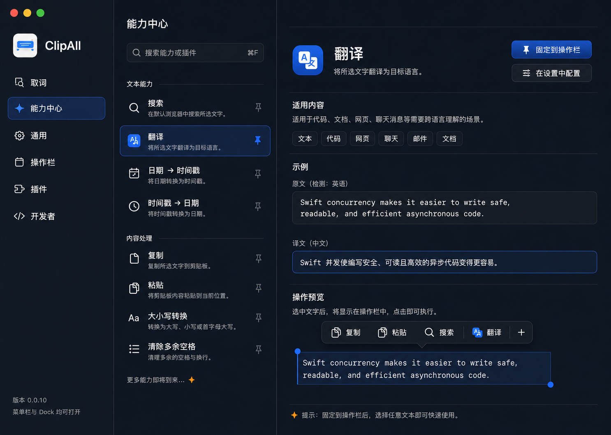

# ClipAll UI Design System

## Status

Approved on 2026-08-15. This document is the visual contract for every new or
materially redesigned user-facing SwiftUI surface in ClipAll.

## Canonical References

The reference images are the source of truth for visual character, color
relationships, density, and hierarchy. They are not permission to add controls
or capabilities that the product does not implement.

### Light appearance


### Dark appearance



If prose and a screenshot appear to disagree about a color relationship, follow
the screenshot and preserve the semantic role described below. Do not sample a
new feature-local color from the image; define or reuse a semantic token in
`ClipAllTheme`.

## 1. Scope And Trigger

Apply this contract when:

- adding a new settings section, browser, detail view, sheet, empty state, or
  selection-overlay state;
- changing shared color, typography, spacing, radius, shadow, material, or row
  behavior;
- introducing a new reusable control under `ClipAll/SharedUI`;
- adapting an existing surface for light or dark appearance.

The target character is a crafted independent macOS text utility: calm,
direct, warm in light appearance, focused in dark appearance, and recognizably
ClipAll. It must not look like an unstyled System Settings pane, Finder clone,
or generic SaaS dashboard.

## 2. Visual Hierarchy

Use this order to separate information:

1. spacing, alignment, grouping, and typography;
2. hairline separators;
3. a semantic surface tint;
4. borders when state or containment still needs clarification;
5. shadow only for genuinely floating or elevated content.

Large windows use three clear levels when the workflow needs them:

- **App navigation**: the most structural plane, carrying identity and major
  destinations.
- **Collection**: compact searchable rows for capabilities, plugins, or rules.
- **Focused detail**: one selected object's purpose, configuration, example,
  and primary action.

Do not wrap the entire content pane in a card. Do not put every section or row
in its own rounded rectangle. A normal list is one grouped plane with spacing
and separators.

## 3. Color Contract

All colors are semantic, centralized in `ClipAllTheme`, and appearance-aware.
Feature views must not define their own brand blue, orange, canvas, selection,
border, or shadow colors.

| Role | Light appearance | Dark appearance |
|---|---|---|
| Canvas | Warm ivory, never stark white | Graphite with a navy undertone, never pure black |
| Navigation | Slightly warmer or deeper than canvas | The heaviest graphite structural plane |
| Content | Quiet ivory with minimal tonal separation | Deep navy-charcoal, one step lighter than navigation |
| Elevated surface | Near-ivory with a restrained shadow | Raised charcoal with a fine cool highlight edge |
| Primary text | Deep ink/navy | Cool near-white |
| Secondary text | Muted blue-gray with readable contrast | Cool gray with readable contrast |
| Brand accent | App-icon cobalt blue | The same cobalt blue, slightly brighter only as needed for contrast |
| Accent soft | Pale blue tint for selection/focus context | Deep blue tint, not a neon glow |
| Spark | App-icon warm orange, used rarely | The same orange, used rarely |
| Separator | Ink at low opacity | Cool white at low opacity |
| Error/warning | Native semantic system colors | Native semantic system colors |

Usage rules:

- Cobalt blue owns selected, focused, pinned, and primary-action states.
- Orange is a small signature detail for delight or a concise hint. It is not
  a second action color and must not fill ordinary controls.
- Red is reserved for destructive or error semantics. The former dusty-red
  global accent is forbidden.
- Dark appearance is designed, not inverted. Preserve the hierarchy by changing
  material weight and luminance rather than reversing every color mechanically.
- The App icon keeps its original blue/orange colors in both appearances.

## 4. Typography

- Use the macOS system font stack so Latin and Chinese text retain native
  optical sizing and legibility.
- Window titles use a compact title style with semibold weight; do not create
  oversized marketing headings inside utility windows.
- Section titles use weight before size to establish hierarchy.
- Body and supporting copy must remain readable at native macOS sizes. Do not
  solve density by shrinking secondary text until it becomes gray noise.
- Use monospaced typography only for code, identifiers, timestamps, or literal
  input/output examples.
- Keep prose lines reasonably short. A detail view should not let explanatory
  text run across the full window width.

Typography values belong in a shared `ClipAllTheme.Typography` namespace when
the same role appears in three or more surfaces.

## 5. Spacing And Geometry

- Keep the existing 4-point spacing rhythm. Prefer the shared values `4`, `8`,
  `12`, `16`, `20`, and `24` through `ClipAllTheme.Spacing`.
- Compact rows should feel deliberate, not cramped. Icons, primary labels,
  secondary labels, and trailing state must align to stable columns.
- Use continuous corners. Controls remain tighter than rows; floating surfaces
  may use the largest shared radius.
- Empty space must express hierarchy or focus. Large unowned blank regions such
  as the former General and Developer pages are a layout defect, not minimalism.
- Do not add fixed widths in a feature view when a shared column or adaptive
  layout can express the same relationship.

## 6. Navigation, Lists, And Selection

- App navigation combines an icon and direct label. Keep the ClipAll identity
  visible without turning it into a decorative hero block.
- Capability and plugin collections use compact rows with a primary label,
  one supporting line, and a trailing state or action only when needed.
- A selected row must be unmistakable through at least two cues: blue tint or
  edge, stronger text/icon treatment, and an accessibility selected state.
- Hover, pressed, keyboard focus, and selection are different states. Do not
  encode all four with the same fill.
- Pin controls remain visually quiet until hover/focus, except when the item is
  pinned. Pinned state uses cobalt blue and a non-color accessibility label.
- Search is the entry point for long collections and belongs near the collection
  it filters, not in a detached toolbar without context.

## 7. Surfaces, Controls, And Cards

- Primary actions may use a cobalt-blue filled control. Secondary actions use
  neutral material or a quiet border. Destructive actions use semantic red only.
- Prefer inline rows and separators for settings. Reserve a card for a truly
  independent object, focused task, empty state, or floating result.
- Never nest `clipAllSurface()` inside another `clipAllSurface()` merely to
  create hierarchy.
- Form fields align with their labels and share a common control height. Avoid
  unrelated hard-coded widths for each field type.
- Icon badges use one coherent geometry derived from the App icon. Do not put
  every SF Symbol in a differently colored rounded square.

## 8. Selection Toolbar And Results

- The selection toolbar is the signature ClipAll surface: compact, horizontally
  ordered, spatially anchored to the selected text, and visually floating above
  the source application.
- The toolbar's standard fill is the appearance-aware `overlaySurface`: warm
  near-ivory in light appearance and deep navy-charcoal in dark appearance.
  Do not use a source-sampling system material as the primary fill; it turns the
  toolbar cool gray over many applications and breaks the approved palette.
- Use `overlayBorder`, `overlayPressedFill`, and the shared overlay hover
  interaction values for its chrome states. Hover stays a quiet tonal lift,
  never a broad cool-gray slab.
- Built-in clipboard actions use primary-ink symbols. Plugin-provided capability
  symbols retain a compact cobalt badge while their labels remain primary text.
- Use context-aware shadow only to separate the toolbar from selected content.
  Avoid stacking translucent foregrounds.
- Press feedback begins immediately. Expansion originates from the control that
  triggered it and reverses along the same path.
- Translation input and output are static labeled displays. Do not place an
  arrow, chevron, connector, animated transition, or directional effect between
  them.
- A result may be selected or copied, but decorative selection handles shown in
  design references are not a required product feature.
- Existing overlay geometry, focus, dismissal, and source-App input contracts in
  `quality-guidelines.md` remain authoritative.

## 9. Motion And Feedback

- Feedback appears on press, not after the action completes.
- Default motion is critically damped and interruptible. Start with a response
  around `0.3...0.4` seconds and no overshoot; add modest bounce only when the
  user's gesture carries momentum.
- Animate from the current presentation state. Never block input while a visual
  transition finishes.
- Motion explains source, hierarchy, state change, or completion. Do not add
  ornamental looping movement, motion trails, or arrows that merely advertise
  that content changed.
- Under Reduce Motion, replace spatial springs with short opacity or color
  transitions while preserving status feedback.
- Under Reduce Transparency or Increase Contrast, strengthen the solid surface
  and border instead of sacrificing legibility.

## 10. Shared Token And Component Contract

`ClipAllTheme` is the only owner of shared visual constants. Extend it with
semantic roles before styling a new feature locally.

```swift
// Correct: the feature describes intent through semantic roles.
Text(title)
    .foregroundStyle(ClipAllTheme.textPrimary)
    .padding(.vertical, ClipAllTheme.Spacing.xs)
    .background(isSelected ? ClipAllTheme.selectionFill : .clear)

// Wrong: a feature invents a new ClipAll palette and geometry.
Text(title)
    .foregroundStyle(Color(red: 0.10, green: 0.42, blue: 0.98))
    .padding(.vertical, 9)
    .background(Color.blue.opacity(0.14))
```

Expected semantic token families:

- `canvas`, `sidebar`, `contentSurface`, `elevatedSurface`;
- `textPrimary`, `textSecondary`, `separator`, `border`;
- `accent`, `accentSoft`, `selectionFill`, `focusRing`, `spark`;
- `shadowFloating`, `shadowElevated`;
- `Typography`, `Spacing`, `Radius`, and `Size` namespaces.

Shared components own hover, pressed, selected, focus, disabled, and appearance
behavior. Feature views supply content and semantic state, not raw opacity or
shadow recipes.

## 11. Good / Base / Bad Cases

- **Good**: a new capability browser reuses the three-level hierarchy, semantic
  palette, compact rows, and one focused detail action in both appearances.
- **Base**: a small settings section remains a plain grouped list with a section
  heading and native controls; it does not need a card or custom animation.
- **Bad**: every section becomes a white rounded card with a one-pixel border,
  weak shadow, arbitrary SF Symbol badge, and a locally chosen accent color.
- **Bad**: dark mode is produced by calling `Color.white.opacity(...)` until the
  light layout becomes barely readable gray-on-gray.

## 12. Required Validation

- Build the full application with `swift build --target ClipAll`.
- Install and launch `/Applications/ClipAll.app` before visual acceptance.
- Capture the affected surface in both light and dark appearance and compare it
  with the canonical references at the same window size and state.
- Check hover, press, keyboard focus, selection, disabled, loading, empty,
  success, and error states that the surface actually exposes.
- Verify Reduce Motion and Reduce Transparency fallbacks for any new motion or
  material.
- Search the changed feature for raw `Color(...)`, feature-local shadow values,
  and duplicated spacing/radius constants. Shared roles belong in
  `ClipAllTheme`.
- Do not claim visual completion until the user accepts the installed app.

## 13. Review Checklist

- [ ] The surface visibly belongs to the approved light and dark references.
- [ ] Blue is the only ordinary action/selection accent; orange remains rare.
- [ ] Hierarchy works without turning every section into a card.
- [ ] Light and dark appearance preserve the same information architecture.
- [ ] Selection and status do not rely on color alone.
- [ ] The selection toolbar remains compact, anchored, and non-disruptive.
- [ ] Translation displays contain no directional arrow or transition effect.
- [ ] New constants and states are centralized in shared UI primitives.
- [ ] Accessibility appearance and keyboard states were checked.
