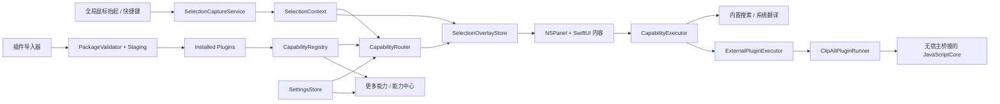

# 技术设计：能力外显与插件交互

## 1. Architecture Summary

采用原生 Swift 模块化宿主 + 独立插件 runner 的结构，不加载第三方 Swift/Objective-C 二进制：

- SwiftUI 负责能力中心、设置、“更多能力”和结果内容。
- AppKit 负责菜单栏生命周期、`NSPanel` 浮层、窗口层级、焦点、全局事件监控和屏幕定位。
- ApplicationServices Accessibility API 负责读取其他应用的选中文字与选区边界。
- Domain 层定义能力、匹配、执行和选区上下文，不依赖具体 UI 或系统服务。
- PluginHost 层负责清单解码、包校验、staging、安装、启停、卸载、开发引用和运行请求。
- `ClipAllPluginRunner` 是独立 executable，只创建无原生桥接的 JavaScriptCore context，接受单次 JSON 请求并返回结构化 JSON；宿主负责超时并可直接终止异常进程。
- Infrastructure 层封装 Accessibility、剪贴板、浏览器、系统翻译、Keychain 和 `UserDefaults`。

首版是菜单栏常驻的 accessory app。能力中心是标准可激活窗口，取词浮层是默认不抢焦点的临时面板。

### 1.1 PopClip Reference Boundary

PopClip 只作为产品行为基准，不作为像素级克隆目标：

| 维度 | PopClip 基准 | ClipAll 首版 |
|---|---|---|
| 触发 | 选中文字后自动出现动作菜单 | 相同，并提供键盘快捷键回退 |
| 用户单位 | Action | Capability（能力） |
| 扩展单位 | Extension 提供 Action | Plugin 提供一个或多个 Capability |
| 上下文 | 只显示相关动作 | 固定能力保持不动，另用推荐行显示相关能力 |
| 管理 | 动作与扩展管理 | “更多能力”检索 + 独立能力中心 |
| 首版边界 | 完整成熟产品 | 复制、搜索、翻译、时间工具示例插件 |

不实现 PopClip 扩展格式兼容，也不复制其品牌、图标和视觉资产。



## 2. Proposed Project Structure

```text
ClipAll/
├── App/
│   ├── ClipAllApp.swift
│   ├── AppDelegate.swift
│   └── AppEnvironment.swift
├── Domain/
│   ├── SelectionContext.swift
│   ├── Capability.swift
│   ├── CapabilityDescriptor.swift
│   ├── CapabilityMatch.swift
│   ├── CapabilityOutput.swift
│   ├── Plugin.swift
│   ├── PluginConfiguration.swift
│   └── ExternalPluginManifest.swift
├── BuiltInPlugins/
│   ├── Search/
│   └── Translation/
├── PluginHost/
│   ├── Manifest/
│   │   ├── ExternalPluginManifestDecoder.swift
│   │   └── ExternalPluginManifestMapper.swift
│   ├── Installation/
│   │   ├── PluginPackageValidator.swift
│   │   ├── PluginInstallationStore.swift
│   │   └── PluginLifecycleController.swift
│   ├── Runtime/
│   │   ├── ExternalPluginExecutor.swift
│   │   ├── PluginRunnerClient.swift
│   │   └── PluginRuntimeProtocol.swift
│   └── Development/
│       ├── DevelopmentPluginStore.swift
│       └── PluginDebugSession.swift
├── Infrastructure/
│   ├── Accessibility/
│   │   ├── AccessibilityPermissionService.swift
│   │   ├── SelectionCaptureService.swift
│   │   └── SelectionMonitor.swift
│   ├── Persistence/
│   │   ├── SettingsStore.swift
│   │   └── PluginConfigurationStore.swift
│   ├── Security/PluginSecretStore.swift
│   └── System/
│       ├── ClipboardService.swift
│       └── BrowserService.swift
├── Capabilities/
│   ├── CapabilityRegistry.swift
│   ├── CapabilityRouter.swift
│   └── ContentFeatureExtractor.swift
├── Features/
│   ├── SelectionOverlay/
│   ├── MoreCapabilities/
│   ├── CapabilityCenter/
│   ├── PluginManagement/
│   ├── PluginDebugger/
│   ├── PermissionOnboarding/
│   └── Settings/
├── SharedUI/
└── Resources/
ClipAllPluginRunner/
├── main.swift
└── JavaScriptPluginRuntime.swift
PluginSDK/
├── Schemas/plugin-manifest-v1.schema.json
└── Fixtures/
Plugins/
└── Examples/
    └── TimestampTools.clipallplugin/
        ├── plugin.json
        ├── main.js
        ├── README.md
        └── Tests/cases.json
ClipAllTests/
PluginRunnerTests/
Docs/PluginSDK/
```

目录边界是运行边界：`BuiltInPlugins` 可调用宿主原生服务，`Plugins/Examples` 只包含可独立复制和导入的外置包，主 App target 不编译其中脚本；`ClipAllPluginRunner` 不链接 AppKit、Accessibility、Security 或宿主业务模块。插件 SDK 文档与机器可读 schema 同步版本化。

## 3. Domain Contracts

### 3.1 Selection Context

`SelectionContext` 是一次取词会话的不可变快照，至少包含：

- `id: UUID`：用于取消和拒绝过期结果。
- `text: String`：去除纯空白后仍保留原始内容。
- `sourceBundleIdentifier` 与来源应用显示名。
- `selectionBounds: CGRect?` 与触发时鼠标位置。
- `createdAt`。

任何异步执行结果返回时都必须核对 `context.id`。出现新选区、关闭浮层或来源失效时，取消旧任务并废弃旧结果。

### 3.2 Capability

能力由声明与执行器组成，核心边界如下：

```swift
struct CapabilityDescriptor: Identifiable, Hashable, Codable {
    let id: CapabilityID
    let pluginID: PluginID
    let name: String
    let symbolName: String
    let purpose: String
    let supportedContentKinds: Set<ContentKind>
    let examples: [String]
    let exclusions: [String]
    let executionKind: CapabilityExecutionKind
}

protocol CapabilityExecuting {
    var descriptor: CapabilityDescriptor { get }
    func execute(in context: SelectionContext) async throws -> CapabilityOutput
}

protocol ClipAllPlugin {
    var descriptor: PluginDescriptor { get }
    var capabilities: [any CapabilityExecuting] { get }
}
```

- `复制` 不进入 `CapabilityRegistry`，由固定的 `BaseAction.copy` 执行。
- 搜索与翻译由宿主内置插件实现；两个时间能力来自外置 manifest，并由 `ExternalPluginExecutor` 适配为同一 `CapabilityExecuting`，因此路由和 UI 不区分执行来源。
- 稳定标识从第一天保留，外置 capability ID 必须以所属 plugin ID 为前缀，避免冲突和后续迁移用户固定配置。
- `CapabilityOutput` 区分立即完成、可呈现结果和外部跳转，浮层据此更新状态。
- `ClipAllPlugin` 仅是宿主内部源码协议，不构成公开二进制 SDK，也不加载外部 `.bundle`。外置 SDK 的稳定边界是 JSON manifest、runner request/response 和结构化结果 schema。

插件的可选配置由 `PluginDescriptor.configurationFields` 声明：

```swift
struct PluginConfigurationField: Identifiable, Codable, Hashable {
    let id: String
    let title: String
    let summary: String?
    let kind: PluginConfigurationFieldKind
    let defaultValue: PluginConfigurationValue
}

enum PluginConfigurationFieldKind: Codable, Hashable {
    case choice(options: [PluginConfigurationOption])
    case toggle
    case text(placeholder: String?)
    case secret(placeholder: String?)
}
```

- 主应用只理解通用字段类型，不硬编码第三方插件的具体设置页面。
- 字段可声明一个基于同插件其他字段值的 `visibleWhen` 条件，用于仅在选择 AI provider 时显示 endpoint、model 和 API key。
- `PluginConfigurationStore` 以 `pluginID + fieldID` 为键持久化非敏感值，在插件注册时补齐默认值并过滤类型不匹配的旧值。
- secret 字段由 `PluginSecretStore` 使用 macOS Keychain 保存；通用配置 store 只持有“是否已设置”的状态，不读取或记录明文。
- 搜索与翻译作为两个独立的内置插件：搜索声明搜索引擎 choice，翻译声明目标语言 choice。
- 没有配置字段的插件返回空数组，能力中心不展示空的“配置”区。
- 外置 v1 manifest 支持 choice、toggle 和 text；secret 字段只对宿主内置插件开放，直到外置权限与密钥授予协议单独设计完成。

### 3.3 Providers

- `SearchProvider` 只负责把查询安全编码为 URL；`BrowserService` 通过 `NSWorkspace` 打开默认浏览器。
- `TranslationProviding` 接收文本、源语言、目标语言和 provider 配置，返回译文与语言信息。
- macOS 15 不能直接创建可下载模型的 `TranslationSession`；系统翻译通过 SwiftUI `.translationTask` 获得 session，并由结果视图负责模型准备和下载授权状态。
- `OpenAICompatibleTranslationProvider` 使用插件配置的 endpoint、model 与 Keychain API key；请求只在用户确认后发出，响应转换为统一 `CapabilityResult`。
- `TranslationProviderRegistry` 首版注册系统翻译和 OpenAI-compatible 两项；DeepL、Google 等未来适配器复用同一协议与配置声明。

### 3.4 External Plugin Package V1

包后缀固定为 `.clipallplugin`，本质是 Finder 可识别的目录 package。v1 只读取以下内容：

```text
Example.clipallplugin/
├── plugin.json       # 唯一清单入口，UTF-8 JSON
├── main.js           # JavaScriptCore 脚本入口
├── README.md         # 可选，仅供作者与用户阅读
└── Tests/cases.json  # 可选，调试器可导入的测试夹具
```

`plugin.json` 的稳定字段为：

```json
{
  "manifestVersion": 1,
  "id": "com.clipall.plugin.timestamp-tools",
  "name": "时间工具",
  "version": "1.0.0",
  "minimumClipAllVersion": "0.0.1",
  "summary": "日期与 Unix 时间戳双向转换",
  "symbolName": "clock.arrow.2.circlepath",
  "runtime": {
    "kind": "javascriptCore",
    "entry": "main.js"
  },
  "configuration": [],
  "capabilities": []
}
```

- plugin ID 使用反向域名格式；capability ID 必须以 `pluginID + "."` 开头；同一安装集内均唯一。
- 版本使用三段 SemVer 数字；未知 `manifestVersion`、不满足 minimum host version 或未知字段类型直接拒绝，不做宽松猜测。
- runtime entry 必须是包内普通 `.js` 文件；规范化路径后不得离开包根目录。包内任何符号链接、别名、硬链接异常或隐藏可执行文件均拒绝。
- 外置配置 v1 支持 choice、toggle、text 以及单字段等值 `visibleWhen`；默认值必须通过同一 schema 校验。外置 secret 暂不开放。
- capability 声明包含名称、SF Symbol、用途、示例、排除项、execution kind、handler 和 routing rules；handler 必须是 `ClipAllPlugin` 全局对象上的安全标识符函数。
- v1 capability execution kind 只允许 `resultPanel`。插件只能返回宿主定义的 title、subtitle 和有限 result items，不能返回自定义视图、HTML、脚本回调或任意文件 URL。

安装校验上限采用宿主常量而不是插件自报：manifest 256 KB、主脚本 1 MB、整个包 5 MB、最多 256 个普通文件、单次选择输入 64 KB、结果 JSON 256 KB、最多 12 个结果项。数值未来调整时保持向后兼容或提升 manifest version。

### 3.5 Import, Enable, Replace And Uninstall

运行目录位于 `Application Support/<bundle-id>/Plugins`：

```text
Plugins/
├── Installed/<plugin-id>.clipallplugin/
├── .Staging/<operation-uuid>.clipallplugin/
├── Receipts/<plugin-id>.json
└── Development/bookmarks.json
```

普通导入遵循事务式流程：

1. `NSOpenPanel` 只选择一个 `.clipallplugin` package。
2. 将源包复制到随机 staging 路径；不在源目录执行任何脚本。
3. 递归校验文件结构与限制，解码 schema，映射为 domain descriptor，并在临时 registry 检查 plugin/capability/config ID 冲突。
4. 展示安装确认摘要：来源路径、未签名状态、版本、能力、配置字段和“无额外权限”。
5. 用户确认后原子移动至 `Installed`，写入包含文件哈希与安装时间的 receipt，再一次性注册全部能力；任一步失败都清理 staging 并保留旧版本。

重复 ID 进入显式“替换”流程：版本相同仍需确认；新包完整通过校验后才停止旧任务、切换目录与 registry。首版不提供后台更新或降级判断，只展示当前/待装版本供用户决定。

插件拥有 `enabled` 状态：

- 停用：取消执行、注销能力、清理固定/最近的活动引用，但保留安装文件和配置。
- 启用：重新校验 receipt 与包内容，成功后原子注册全部能力；失败时保持停用并展示原因。
- 卸载：二次确认后先停用，再删除 App 管理的安装副本和 receipt；默认保留 namespaced 配置，勾选“同时删除插件数据”才删除 UserDefaults/Keychain 值。
- 开发引用：移除时只删除引用与活动注册，绝不删除被引用的源码目录。

`CapabilityRegistry` 因此需要以 plugin ID 为单位的原子 `register` / `unregister`：任一 capability 冲突会让整插件注册失败；注销会发布一次完整快照，避免 UI 观察到半个插件。

### 3.6 Runner Protocol And Isolation

宿主每次执行都启动一个短生命周期 `ClipAllPluginRunner` 进程，通过 stdin/stdout 交换一条带 `protocolVersion` 的 JSON；请求包含脚本文本、handler、选中文字、locale、系统时区和已校验的非敏感配置。runner 不接收插件路径，避免脚本自行遍历安装目录。

runner 使用 JavaScriptCore 创建全新 context，只提供：

- 标准 ECMAScript/JavaScriptCore 内建对象。
- 不含原生回调的内存 `console`，日志只回传给开发调试会话。
- 冻结的 request JSON。

不注入 `FileManager`、`URLSession`、`NSWorkspace`、剪贴板、Accessibility、shell 或 Objective-C 对象。宿主施加 750 ms 默认超时并限制请求、响应和日志大小；超时或 runner 崩溃时终止子进程并返回插件级错误。单次进程模型同时隔离全局变量和上一次执行残留。进程级内存硬限制作为完整 Xcode/helper 验证阶段的必测项；在此之前不得宣称可安全运行恶意插件。

成功响应必须解码为 `PluginRuntimeResponse.success(CapabilityResult)`；错误响应只包含错误 code、面向用户的安全消息、可选调试位置和已截断日志。宿主重新校验所有字符串、条目数和枚举值，不能信任 runner 已校验。

### 3.7 Plugin Developer Mode

开发者模式默认关闭，状态保存在全局设置。开启后能力中心增加：

- `加载未打包插件…`：保存开发目录引用并校验，插件标记为“开发中 / 未签名”，不复制、不删除源目录。
- `重新载入`：先在临时实例完成 manifest、脚本与冲突校验，成功后再原子替换活动实例；失败时旧实例继续工作。
- `插件调试器`：左侧列能力，右侧提供测试输入、当前配置、匹配特征/分数/理由、执行按钮、结构化结果、耗时、错误和内存日志。
- `运行夹具`：读取包内 `Tests/cases.json`，逐项验证期望 capability、输出字段或错误 code；夹具不能调用宿主测试代码。

调试输入与 console 日志只保留在当前调试 session；关闭窗口、重新加载或退出应用即清空。统一系统日志只记录 plugin ID、capability ID、阶段、耗时和错误 code，不记录原文、结果正文、配置值或源路径。

### 3.8 External Timestamp Tools Reference Plugin

`TimestampTools.clipallplugin` 是 SDK 的纵向参考，而非宿主 Swift 代码：

- `main.js` 的 `timestampToDate` 只接受去除首尾空白后的 10 位或 13 位纯数字。10 位按 Unix 秒解析，13 位按 Unix 毫秒解析；越界、非有限结果或无效 `Date` 时返回稳定错误 code。
- `dateToTimestamp` 优先解析带 `Z` 或 `±HH:mm` 时区的 ISO 8601，再严格解析 `yyyy-MM-dd HH:mm:ss`、`yyyy/MM/dd HH:mm:ss`、`yyyy-MM-dd'T'HH:mm:ss` 和 `yyyy-MM-dd`。仅日期按当天 `00:00:00` 解释。
- 配置 `timeZone` 可选 `system` / `utc`；无时区输入按该配置解释，并在结果 subtitle 标注。配置 `displayFormat` 可选 `standard`、`iso8601`、`chinese`，每次执行从 request configuration 读取，不缓存旧值。
- 时间戳转日期输出“所选时区”格式化结果与 UTC ISO 参考；日期转时间戳输出秒、毫秒和按所选格式规范化的解释结果。所有 result item 由宿主渲染并可逐项复制。
- JavaScript 中使用显式字段解析与回写校验，不能依赖实现宽松的 `Date.parse` 处理无时区常见格式。

两个能力分别声明 routing rules：时间戳能力命中 10/13 位结构化特征，日期能力命中严格日期特征；理由直接来自 manifest，例如“检测到 13 位 Unix 毫秒时间戳”。`Tests/cases.json` 覆盖秒/毫秒、三种显示格式、系统/UTC、闰日、时区偏移、越界和无效输入。

## 4. Selection Capture And Triggering

### 4.1 Permission Flow

1. 启动时使用 `AXIsProcessTrustedWithOptions` 检查辅助功能权限。
2. 未授权时显示简短说明和“打开系统设置”操作，不启动选区读取。
3. 授权变化后允许用户从菜单栏重新检查，不要求重建配置。
4. 不把权限拒绝当作崩溃或无限弹窗条件。

### 4.2 Pointer Flow

1. 使用 `NSEvent.addGlobalMonitorForEvents` 观察全局左键抬起事件。
2. 进行短暂防抖，等待来源应用提交最新选区。
3. 从 system-wide Accessibility element 获取 focused UI element。
4. 读取 `kAXSelectedTextAttribute` 和 selected range。
5. 使用 `kAXBoundsForRangeParameterizedAttribute` 获取屏幕坐标；失败时退回鼠标位置。
6. 仅当文字非空且和最近上下文不同，才创建新 `SelectionContext`。

### 4.3 Keyboard Flow

全局快捷键触发相同的捕获函数，而不是复制另一套逻辑。快捷键可配置；首版提供默认值，但所有调用最终都进入 `SelectionCaptureService.captureCurrentSelection()`。

### 4.4 Compatibility Failures

Accessibility 调用可能返回 API disabled、not implemented、unsupported 或 cannot complete：

- 权限问题进入引导状态。
- 无文字或属性不支持时不显示空浮层。
- 有文字但无 bounds 时以鼠标位置或当前屏幕中心附近定位。
- 调用超时或来源应用无响应时结束本次捕获，不复用历史内容。

## 5. Overlay Window And Focus

- 使用一个复用的 `NSPanel`，避免每次选区创建新窗口。
- 面板初始采用 non-activating 行为，不改变来源应用当前焦点。
- 展开“更多能力”并进入搜索输入时，面板才进入可接受键盘输入的状态；关闭后恢复为非激活状态。
- 面板位置由纯函数 `OverlayPlacement.calculate(anchor:panelSize:visibleFrame:)` 计算，方便单元测试。
- 优先下方、空间不足放上方；横向和纵向均 clamp 到 `NSScreen.visibleFrame`。
- 点击面板外、按 Escape、来源应用/选区变化时关闭或替换当前上下文。

SwiftUI 根视图只消费 `SelectionOverlayStore`：

- `idle`
- `ready(context, fixedCapabilities, recommendation?)`
- `searchingCapabilities`
- `executing(capabilityID)`
- `showingResult(capabilityID, output)`
- `failure(capabilityID?, message, recovery)`

## 6. Capability Routing

首版不依赖大模型、Embedding 或网络服务。路由必须快速、本地、可解释：

1. `ContentFeatureExtractor` 提取语言、URL、邮箱、代码、地址倾向、长度和普通文本等特征。
2. 硬性排除规则先移除不适用能力。
3. `supportedContentKinds`、语言差异、声明关键词和示例特征形成分数。
4. 相同分数用稳定能力 ID 排序，不用随机数或最近使用打乱推荐。
5. 低于阈值的结果不形成推荐。
6. 从推荐候选中排除当前固定能力；剩余第一项进入推荐行。
7. 其余候选传给“更多能力”，并生成一条来自命中特征的短理由。

时间戳和日期检测属于高置信度结构化特征，命中时优先于通用搜索；两个时间能力都由外置 `TimestampTools.clipallplugin` 声明，但只让与当前输入方向一致的能力获得有效分数。

自由文本 `purpose`、`examples` 与 `exclusions` 既用于能力中心展示，也构成未来语义匹配器的稳定输入合同；升级匹配实现时不改变 UI 和能力执行协议。

## 7. Discovery And Management

### 7.1 More Capabilities

- 数据源统一来自 `CapabilityRegistry`。
- 空查询由 `CapabilityDiscoveryModel` 截断为 5 个匹配项和 3 个去重后的最近项。
- 非空查询匹配能力名称、用途描述和插件名称，结果仍受面板最大高度控制并可滚动。
- 键盘使用上下箭头移动、Return 执行、Escape 返回/关闭；指针路径调用同一 action。

### 7.2 Capability Center

- 使用 SwiftUI 标准窗口和 `NavigationSplitView`。
- 左侧分为能力与插件：能力提供全部、已固定、权限/不可用筛选；插件提供已安装、已停用和开发中状态。主区域展示详情与对应操作。
- 拖动排序只修改固定 ID 数组；超过 4 项时拒绝并显示说明。
- 顶部提供“导入插件”，开发者模式下追加“加载未打包插件”；外置插件详情提供启用/停用、重新载入（开发引用）、调试和卸载。
- 首版默认注册搜索与翻译；导入时间工具后才注册它的两个能力。测试注册表还可以注入大量虚拟 descriptor 验证扩展性。
- 时间工具首次安装时不固定；卸载或停用时，对应固定槽立即移除但不以其他能力自动补位。

### 7.3 Settings Window

使用 SwiftUI `Settings` scene 与原生 `TabView`，保持标准 macOS 窗口、工具栏和表单行为：

- 通用：自动取词启停、快捷键摘要、辅助功能权限状态与打开系统设置入口。
- 能力：最多 4 个固定能力及顺序；这里只管理稳定外显，不展示推荐排序。
- 插件：已安装/停用/开发插件列表、导入、启停、卸载，以及按 manifest schema 渲染的配置。
- 开发者：总开关、加载未打包插件、重新载入、移除开发引用和插件调试器入口。关闭开发者模式会卸载开发实例但保留 bookmark 与源码。

能力中心仍负责搜索、查看说明和发现能力，并可深链到对应设置分区；插件生命周期和长期偏好只由设置页执行，避免两个窗口产生冲突状态。

## 8. Persistence And Configuration

使用职责清晰的 store 封装 `UserDefaults` 与 Keychain，不引入数据库。

`SettingsStore` 只保存全局设置：

- 固定能力 ID 与顺序，默认 `[search, translate]`。
- 最近使用能力 ID，采用有界列表。
- 全局快捷键配置。
- 自动取词启用状态。
- 是否已展示权限说明。
- 开发者模式开关。
- 外置插件 enabled 状态与开发目录引用元数据；开发引用的安全访问 bookmark 在完整 App 构建阶段验证。

`PluginConfigurationStore` 保存按插件隔离的配置：

- 搜索插件的搜索引擎，默认 Google，可选 Bing 与 DuckDuckGo。
- 翻译插件的 provider、目标语言、AI endpoint 和 model，默认使用 Apple 系统翻译与当前系统语言。
- 时间工具插件的时区和日期显示格式；键名完全来自其 manifest，不在宿主业务代码硬编码。
- 未来插件声明的 choice、toggle、text 和 secret 字段；secret 实际值由 Keychain store 管理。

读取时过滤当前未注册的能力 ID；写入时去重并限制固定能力最多 4 项。插件停用/卸载只移除活动引用，不自动删除 namespaced 配置。视图和能力执行器不得直接读写 `UserDefaults`。

## 9. Privacy, Sandbox And Distribution

- 原始选中文字只存在于当前 `SelectionContext`，不写入日志、磁盘或分析事件。
- 路由和系统翻译均在本机完成；Apple 文档说明 `TranslationSession` 的翻译内容在设备端处理。
- 搜索只有用户明确执行后才构造 URL 并交给默认浏览器。
- Apple 官方 App Sandbox 文档将辅助类应用使用 Accessibility API 列为不兼容行为，因此 App target 首版关闭 App Sandbox。
- 关闭 App Sandbox 意味着本任务不以 Mac App Store 为发布目标；签名、公证和更新渠道留到后续分发任务。
- 外置插件仍按不可信输入处理：安装器不从源目录执行脚本，拒绝链接与路径穿越，安装后校验 receipt；runner 不继承宿主对象或服务桥接。
- v1 本地插件未建立作者身份与供应链信任。安装确认必须写“未签名本地插件”，只描述其声明能力和零权限，不使用“安全插件”措辞。

## 10. Error Handling And Observability

- 领域错误统一映射为用户可理解状态：权限、无选区、不支持、提供方不可用、语言模型未安装、取消和未知错误。
- 取消或旧 context 返回不显示为失败，也不覆盖当前界面。
- 使用 `Logger` 记录 subsystem、category、能力 ID、耗时和错误类型；禁止记录原文、译文和完整搜索 URL。
- Debug 构建与开发者调试器可显示当前内容特征、匹配分数和原因，Release 浮层只显示简短推荐原因。
- 插件导入错误使用稳定 code（schema、path、size、conflict、version、runtime）；展示可定位到 JSON pointer 或文件名，但不回显脚本文本。
- runner stdout 只允许协议 JSON，stderr 视为截断后的调试信息；正式执行丢弃 console 正文，调试 session 只在内存保留。

## 11. Verification Strategy

- Domain 单元测试：内容特征、匹配排序、阈值、固定能力排除、稳定 tie-break、结果上限。
- State 单元测试：新 context 取消旧任务、结果过期、能力状态转换、设置迁移和固定上限。
- Geometry 单元测试：屏幕四边、选区上下空间、多屏不同坐标和 bounds 缺失。
- Infrastructure 使用协议和 fake 测试 AX 错误映射、搜索 URL 编码、剪贴板和翻译错误映射。
- Manifest/installer 测试覆盖合法包、未知 schema、路径穿越、符号链接、超限、重复 ID、配置默认值、staging 回滚、替换失败和卸载数据策略。
- Registry 测试覆盖插件级原子注册/注销以及固定、最近和推荐快照的一致性。
- Runner 协议测试覆盖成功、JS 异常、超时、崩溃、非法/超限输出、日志截断和连续执行无共享状态。
- Timestamp fixture 测试固定 locale/time zone，覆盖秒/毫秒、三种显示格式、ISO 8601、无时区解释、闰日、越界、无效日期和双向结果；测试只通过 manifest + runner 公共边界运行。
- 手动验证 TextEdit、Safari 等支持 Accessibility 的应用，以及权限拒绝、无 bounds、多显示器、键盘路径和翻译模型下载。

## 12. Compatibility And Rollback

- Deployment target 固定为 macOS 15；不添加旧系统条件分支。
- App Sandbox 明确关闭，相关 entitlement 和分发选择必须在实现评审中复核。
- 如果自动鼠标触发在某些应用中噪声过高，可以通过单一 `SelectionMonitor` 开关退回“仅快捷键触发”，不改动捕获、路由和浮层层级。
- 如果系统翻译不可用，可暂时将翻译能力标记为不可用；搜索、复制、能力中心和路由仍可独立工作。
- 如果 runner 不可用，所有外置能力统一标记不可用，但导入校验、卸载、内置搜索、翻译和基础浮层仍可工作。
- 如果示例插件解析出现回归，可停用或卸载 `TimestampTools.clipallplugin`，不影响内置搜索、翻译和基础浮层；开发引用重新载入失败时保留上一个活动实例。

## 13. Evidence

- [AppKit](https://developer.apple.com/documentation/appkit)：原生 macOS 窗口、面板和事件 UI。
- [Global event monitor](https://developer.apple.com/documentation/appkit/nsevent/addglobalmonitorforevents%28matching%3Ahandler%3A%29?changes=_8)：观察其他应用收到的事件；键盘事件要求辅助功能信任。
- [AXUIElement](https://developer.apple.com/documentation/applicationservices/axuielement_h)：跨应用可访问性对象和错误模型。
- [Selected text](https://developer.apple.com/documentation/applicationservices/kaxselectedtextattribute)：读取可访问文本对象的选中文字。
- [Bounds for range](https://developer.apple.com/documentation/applicationservices/kaxboundsforrangeparameterizedattribute?changes=_7)：获取所选文本范围的屏幕边界。
- [TranslationSession](https://developer.apple.com/documentation/translation/translationsession)：系统翻译会话、语言准备和设备端处理。
- [JavaScriptCore](https://developer.apple.com/documentation/javascriptcore)：独立 runner 内的脚本执行引擎；ClipAll 不向 context 注入宿主服务对象。
- [App Sandbox limitations](https://developer.apple.com/documentation/security/protecting-user-data-with-app-sandbox)：辅助类应用使用 Accessibility API 与 App Sandbox 不兼容。
