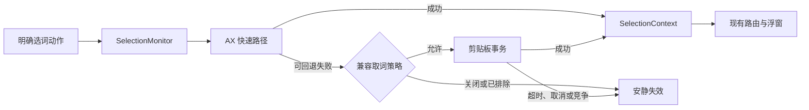

# 跨 App 选区兼容：技术设计

## 1. Architecture

本阶段保留现有浮窗、能力路由和插件执行链，只调整选区触发与捕获层。

| 边界 | 责任 | 不负责 |
|---|---|---|
| `PointerSelectionGesture` | 判定拖选、双击/三击、Shift-click | 读取正文、操作剪贴板 |
| `SelectionMonitor` | 调度、取消和去重 | 解释 AX 树、保存剪贴板正文 |
| `SelectionCaptureService` | AX 优先并按策略选择复制回退 | 展示浮窗、持久化设置 |
| `ClipboardSelectionFallback` | 建立快照、合成复制、轮询、恢复 | 路由能力、修改来源 App 焦点 |
| `SettingsStore` / General Settings | 保存总开关和 App 排除名单 | 执行捕获事务 |

## 2. Trigger Contract

`PointerSelectionGesture.end` 保持返回 `Bool`，只增加 `isShiftPressed` 参数；达到 4pt 的拖选、双击/三击或 Shift-click 返回 `true`。普通单击和低于阈值的移动返回 `false`，不引入只为日志服务的新枚举。

现有指针、注册快捷键和菜单命令入口本身都属于用户明确动作，可以在 AX 失败后进入复制回退；普通 `NSEvent.keyDown` 仍不注册、不修改、不回放。

每次新动作取消前一个 `captureTask`。只有当前任务、当前前台进程和当前捕获代次同时有效时才能发布 `SelectionContext`。重复抑制继续在最终上下文产生后运行。

## 3. Layered Capture Contract

`SelectionCapturing.captureCurrentSelection(triggerLocation:)` 只改为 `async throws`，不增加请求对象。`SelectionCaptureService` 通过初始化闭包读取当前总开关和排除名单；现有 AX 候选顺序、Text Marker、有限祖先遍历与 bounds 逻辑保持不变。

AX 错误分为三组：

| 错误组 | 结果 |
|---|---|
| `permissionRequired` | 请求/刷新辅助功能权限，不进入回退 |
| `secureInput` | fail closed，不进入回退 |
| `noFocusedElement`、`noSelection`、`unsupported`、`sourceUnavailable` | 策略允许时进入复制回退 |

安全输入必须从当前通用 `unsupported` 中拆为独立错误，否则无法阻止密码框误入复制回退。复制回退生成的上下文使用捕获前固定的来源 App；bounds 为 `nil`，现有浮窗自然回退到触发位置。

## 4. Clipboard Transaction

新增一个具体的 `ClipboardSelectionFallback`。生产环境直接使用 `NSPasteboard.general` 和 CGEvent；测试传入命名 pasteboard、复制闭包和更短超时。单一实现不再包装成 pasteboard、copy sender 和时钟三套协议。

事务顺序固定：

1. 固定前台 App 的 PID、Bundle ID 和名称，检查开关与排除名单。
2. 物化 pasteboard items 的全部声明类型；最多 16 个 item、32 个类型、32 MiB，总量或任一类型不可读取时在修改前终止。
3. 清空剪贴板并记录本事务 change count，发送一次带 Command 的 `C` keyDown/keyUp。
4. 每 10ms 轮询一次，最多 800ms；只接受清空后新 change count 中的非空字符串。
5. 在一次额外的 10ms 稳定窗口后，仅当 change count 仍属于本事务时恢复快照；若外部再次修改则保留外部新内容。

`defer`/取消处理必须覆盖成功、超时、来源切换和任务取消。恢复本身不应被任务取消跳过。任何日志只记录阶段、耗时、来源 Bundle ID、错误枚举和是否恢复，不记录正文或快照类型数据。

## 5. Settings, Compatibility And Rollback

`SettingsStore` 新增两个持久化字段：

| 字段 | 默认值 | 说明 |
|---|---:|---|
| `isSelectionFallbackEnabled` | `true` | 仅控制 AX 失败后的复制回退 |
| `selectionFallbackExcludedBundleIdentifiers` | `[]` | Bundle ID 去重、稳定排序 |

通用设置页直接内联“兼容取词”卡片：开关、简短隐私说明、选择 `.app` 添加排除项以及删除按钮，不新增只使用一次的子页面。ClipAll 自身和无 Bundle ID 的包拒绝加入。

不新增 Accessibility 以外的权限，不引入 macOS Service、OCR、目标进程注入或浏览器脚本。TextGO 的 GPL-3.0 代码不复制，只独立实现经公开行为验证的状态机。

回滚面是单一设置开关：关闭后完整恢复当前 AX-only 行为。若发布后发现剪贴板恢复风险，可远离捕获链地将默认值改为关闭；已保存的用户选择不被迁移覆盖。

## Risks And Deferred Items

| 风险 | 当前控制 |
|---|---|
| 私有或惰性 pasteboard 类型无法可靠物化 | 修改前终止，不清空剪贴板 |
| 用户在短事务窗口内主动复制 | change count 竞争检测，检测到外部变化就不恢复 |
| 慢 App 超过 800ms 才完成复制 | 本阶段确定超时并安静失败，不无限等待 |
| 目标 App 不支持 AX，也不响应系统复制 | 明确不支持，不复用历史选区 |
| Chromium/Electron 仍有特例 | 真实矩阵后再评估 `AXManualAccessibility`，不在 MVP 中写入目标进程属性 |
