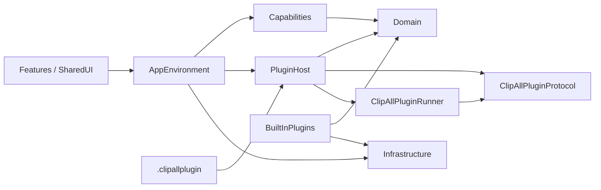
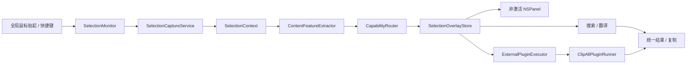

# ClipAll 工程架构

## 目标

ClipAll 是 macOS 15+ 菜单栏应用。主程序负责跨应用取词、能力编排和统一界面；外置插件只声明能力并完成受限的本地文本转换。工程边界必须保证插件增加时，取词浮层、宿主权限和核心代码不会一起膨胀。

## 目录

```text
ClipAll/
├── App/                    # 生命周期、依赖装配、菜单栏入口
├── Domain/                 # 不依赖具体 UI/系统服务的稳定模型
├── Capabilities/           # 注册表、内容特征、路由、发现
├── BuiltInPlugins/         # 可信原生插件：搜索、翻译
├── PluginHost/
│   ├── Manifest/           # 外置清单解码与 domain 映射
│   ├── Validation/         # 包路径、大小、权限与指纹校验
│   ├── Installation/       # staging、receipt 与原子安装/卸载
│   ├── Lifecycle/          # 安装、启停、开发引用的宿主编排
│   ├── Runtime/            # runner 客户端与 JSON 协议
│   └── Development/        # 开发引用、重载、调试 session
├── Infrastructure/         # AX、持久化、Keychain、系统与翻译服务
├── Features/               # 浮层、插件配置/能力管理、设置与调试器
└── SharedUI/               # 无业务归属的原生 UI 小组件

ClipAllPluginProtocol/      # 主程序与 Runner 共用的 JSON DTO/限制
ClipAllPluginRunner/        # 独立短进程；只链接 Foundation/JavaScriptCore
PluginSDK/Schemas/          # 机器可读兼容合同
Plugins/Examples/           # 不参与主 App 编译的外置示例包
Docs/PluginSDK/             # 插件作者文档
Verification/               # CLT 可运行的核心、Runner 与生命周期验收程序
```

## 依赖方向



- `Domain` 不导入 SwiftUI、AppKit、JavaScriptCore、Security 或 Accessibility。
- `BuiltInPlugins` 是随宿主编译的可信源码，可经协议使用浏览器、系统翻译等服务。
- `PluginHost` 只把外置 manifest 映射为 Domain 类型，并通过 JSON 调用 runner；不把宿主服务对象传给脚本。
- `ClipAllPluginRunner` 不依赖主 App target，不链接 AppKit、Security、Accessibility，也不读取插件目录。
- `Features` 不直接读写 `UserDefaults`、Keychain 或插件文件。

## 选区到能力的运行链路



- “复制”是宿主基础动作，始终位于操作栏首位，不进入插件注册表。
- 用户固定的能力显示在首行；路由器只推荐未固定且超过阈值的一个能力。
- “更多”按当前内容匹配、最近使用和搜索结果展示能力，不把全部插件平铺到浮层。
- 每次选区生成新的 `SelectionContext.id`。异步结果回写前必须核对该 ID，旧选区、关闭浮层或切换应用后丢弃旧结果。
- 搜索由宿主打开浏览器；系统翻译通过 macOS Translation API，AI 翻译使用用户配置的 HTTPS OpenAI-compatible endpoint 和 Keychain API key。

## 插件分类

| 类型 | 位置 | 执行方式 | 权限 | 可卸载 |
|---|---|---|---|---|
| 内置插件 | `ClipAll/BuiltInPlugins` | 主进程原生 Swift | 由宿主明确注入 | 否 |
| 已安装外置插件 | Application Support/Plugins/Installed | runner 内 JavaScriptCore | v2 为零宿主权限 | 是 |
| 开发插件 | 用户选择的源码目录 | runner 内 JavaScriptCore | v2 为零宿主权限 | 移除引用，不删源码 |

时间工具属于外置插件。仓库中的 `Plugins/Examples/TimestampTools.clipallplugin` 既是可导入示例，也是 SDK 的端到端契约测试对象；主 App 中不得另写一套时间转换执行器。

设置页中的“插件”标签采用三栏结构：左侧为设置分类，中栏为插件列表，右侧为所选插件的能力、配置、启停与卸载详情。内置插件与外置插件使用同一配置表单；外置插件只有经过普通导入确认后才会进入活动注册表。

## 数据所有权

- 全局设置：`SettingsStore`，包括启停、固定顺序、最近使用、快捷键和开发者模式。
- 插件非敏感配置：`PluginConfigurationStore`，按 `pluginID + fieldID` 隔离。
- 内置插件 secret：`PluginSecretStore` / Keychain。外置 manifest v2 不支持 secret。
- 插件运行文件：`PluginInstallationStore` 管理的 Application Support 目录。
- 选中文字：只存在于当前 `SelectionContext` 与一次 runner request，不落盘。

## 变更规则

- 修改 manifest 或 runner JSON 字段时，必须同步更新 Swift DTO、JSON Schema、SDK 文档、时间工具示例和兼容测试。
- v2 字段语义不能静默改变；不兼容变更提升 `manifestVersion` 或 `protocolVersion`。
- 新宿主能力不能直接暴露给脚本。先设计权限、用户授权、最小 API 和独立威胁模型。
- 插件注册与注销按 plugin ID 原子发生，UI 不应观察到只加载一部分能力的状态。

## 本地构建与验证

本地 App bundle、Runner 嵌入和时间工具示例资源由 `Scripts/build-local-app.sh` 重复生成；产物会随本机 Swift SDK 与签名身份变化，并非 bit-for-bit 可复现。开发与验收命令见 [Development.md](Development.md)。
